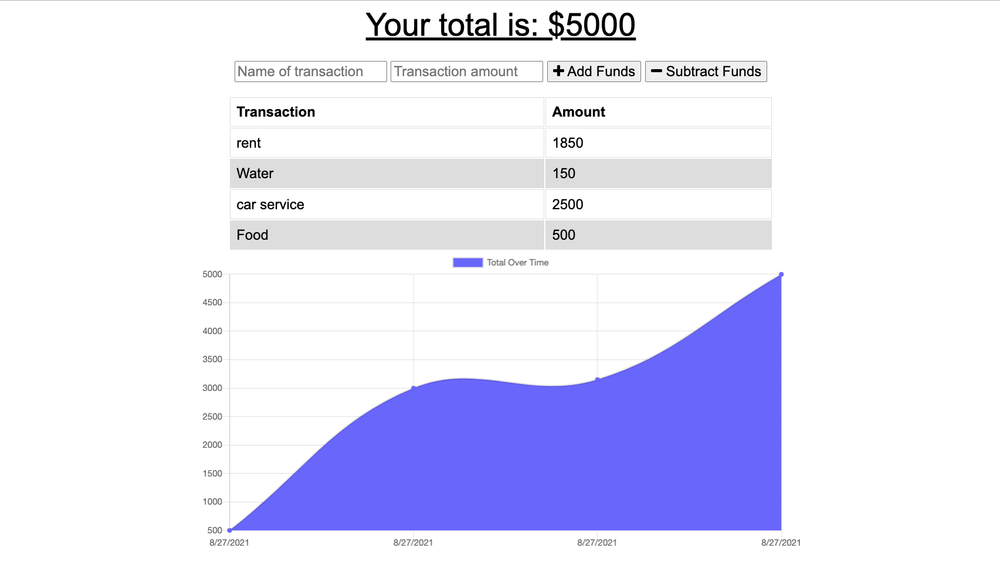

# Homework-19 Budget Tracker

## Description

The purpose of this activitiy was to add functionability to an expense tracker app where an user will be able to add expenses and deposits to their budget with or without a connection. When entering transactions offline, the user is able to populate the total when brought back online.

## Technologies Used

The following technologies were used for the building process of the app:

- MongoDB
- Mongoose
- Node js
- Express for route handling
- Heroku for deployment

## Application screenshot

The following image is a screenshot of the app.

## Aplication deployment:

### Heroku:

https://budgettracker8907.herokuapp.com/

### Github Repository:

https://github.com/LuisBonilla89/Homework-19-Budget-Tracker

## License:

MIT License.
